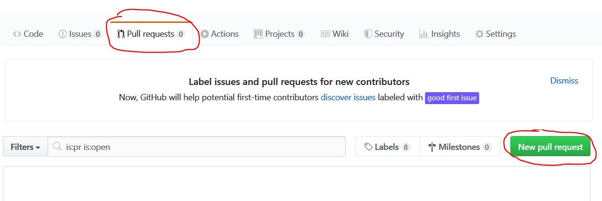
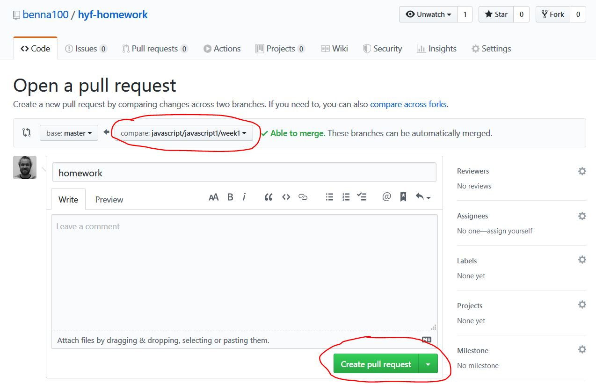
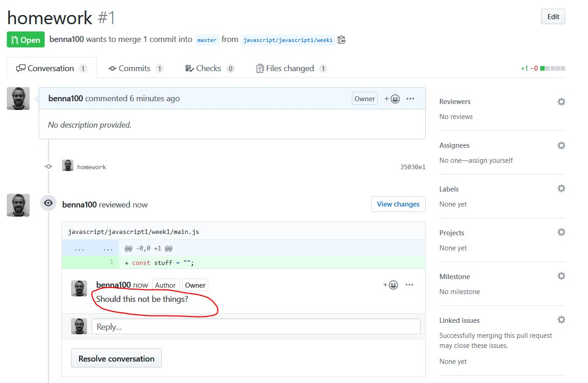
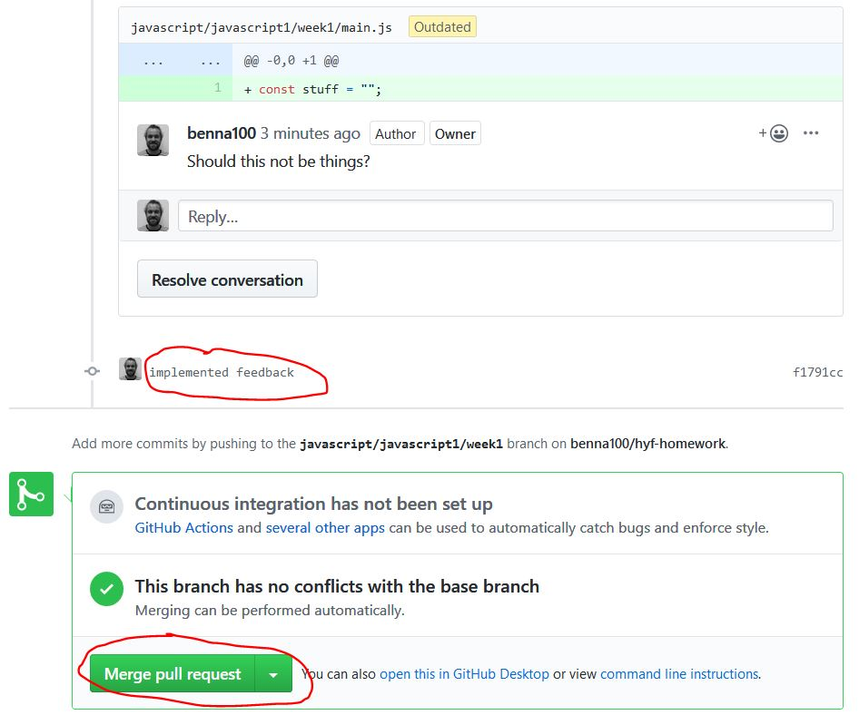
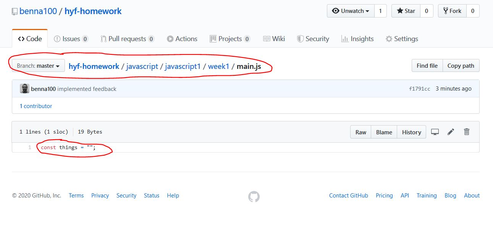

# Homework


## Step 1: Before you start with the homework:
1. Watch: <a href="https://www.khanacademy.org/computing/computer-programming/programming/intro-to-programming/v/programming-intro" target="_blank">What is programming</a> Just watch the 2 min video, you do not have to do the entire JavaScript course (It could be useful later on though). 

## Why should I do this homework?
> One must be able to crawl before understanding the true nature of Javascript - Albert Einstein

This homework will get you started developing in javascript. What you learn the first 3 modules of javascript will be building blocks for creating great javascript web applications.

If you struggle to do this weeks homework there are a couple of things to do:
- Watch the class recording. If it for some reason is missing. Then watch these: [part 1](https://www.youtube.com/watch?v=uhTRC33cpp0), [part 2](https://www.youtube.com/watch?v=mVgyjr9MV5U)
- Read up on javascript basics [here](readme.md#variables)


## Step 2: Javascript warm up part one
Lets get started with some warm up exercises: On freeCodeCamp.com do the <a href="https://learn.freecodecamp.org/javascript-algorithms-and-data-structures/basic-javascript" target="_blank">Basic JavaScript</a> exercises up and until the **"Manipulate Arrays With push()"** exercise (there are some topics we did not cover but you can do it).

Please add your freecodecamp username as answer for this exercise!

You have finished the warmup exercises, well done!

## Step 3: Smart-ease - We help where we can
Enough warm up, lets get to the real problems! We will assume a real world business case where you (the developer) needs to help a business that is starting up (a startup) with solving some of their problems related to JavaScript! Here we go:

---

Lets imagine that we have just started a cool new tech startup called **Smart-ease**. And lets imagine we even have this cool website url: `smart-ease.io` Now we are in business!

At **Smart-ease** we focus on solving real world problems. We venture into the world to help people, and by helping people, we create a sustainable business. 

Cool now lets venture into the world and see which problems we can solve with some of these cool products that Smart-ease will develop with your help:


### Age-ify (A future age calculator)
> You are talking to a friend who suddently looks at you and asks: "How old will you be in 2045?" Hmm you remember the year you were born and try to do some calculation: Born in 1987 + 3 that's 1990. 90 - 40 is 50 + 5 thats 58. I will be 58! Wow that was painful! Let's fix that by making some code that automatically does this!

Create two variables called `yearOfBirth` and `yearFuture`. Assign these your own age and a future year.
What type will these two variables be? Now calculate the age and store that in a variable called `age`. Log out this string:
"You will be 40 years old in 2027". With 40 being the result of the `age` variable and 2027 being the `yearFuture` variable. (Hint use string concatenation)

### Goodboy-Oldboy (A dog age calculator)
> The same friend (who by the way loves dogs) asks how old his dog will be in 2045. Hmm you think, lets make this into a product as well!
Dogs age can either be measured in dog years or in human years, this we want to take into consideration! 

Like before lets create three variables but this time we call them `dogYearOfBirth`, `dogYearFuture` and `dogYear`. We add an extra variable called `shouldShowResultInDogYears`. If it is `true` we should show the result in dog years, if it is false we should show it in human years. What do we call this type of variable? Now log this string out:
"Your dog will be 10 human years old in 2027"
or 
"Your dog will be 70 dog years old in 2027"

### Housey pricey (A house price estimator)
> Two of your friends are considering buying a house, but cannot figure out what the right price should be. Your friends know the width, the height and the depth of the house and the garden size. Lets help them figure out if they paid too much:

We have made our own formula for calculating the price of a house. This formula is VERY simplified and not at all close to the real calculation which can get <a href="https://www.kaggle.com/erick5/predicting-house-prices-with-machine-learning" target="_blank">quite complicated</a>:
```js
housePrice = volumeInMeters * 2.5 * 1000 + gardenSizeInM2 * 300
```

Your friend Peter is considering a house that is 8m wide, 10m deep and 10m high. The garden size is 100m2. The house costs 2.500.000.
Your friend Julia is considering a house that is 5m wide, 11m deep and 8m high. The garden size is 70m2. This house costs 1.000.000.

Figure out if Peter and Julia are paying too much or too little using Javascript and the formula specified above.

### Ez Namey (Startup name generator) *Optional*
> At a meetup you overhear a conversation between two developers. It went something like this: "Man i wish picking a startup name was easier! You need to be creative, funny and interesting, its nearly impossible!" Another problem to solve, awesome!

Lets help people who struggle finding a startup name by creating some code!

Create two arrays called `firstWords`, `secondWords`. The arrays should have 10 elements containing strings of possible startup names. Some examples could be: "Easy", "Awesome", "Corporate".
Create a variable called `startupName` that will contain created startup name.  
Using a random index (you choose) of the arrays and concatenation of strings, create and log the new startup name and the number of characters in it. 
An example could be: "The startup: "Easy Corporation" contains 16 characters"

Hint: you can use this code to generate a random number from 0-9, if you dont want to specify the indexes yourself.
```js
const randomNumber = Math.floor(Math.random() * 10) + 0
```
---

4 projects from one startup, thats incredible! Lets hope one or more of these projects actually becomes popular!

To be continued...


## Step 4: Hand in Homework:

We are going to be handing in homework using something called a **pull request (now PR)**. The reason for that is that **most companies use PR's** when they work with code. So you might aswell get used to it! 

Watch [this video](https://www.youtube.com/watch?v=feyBVDhFQuk) to go through the same process as is documented here

**Okay, lets go!**

-----

Use the `hyf-homework` repo and find the folder on your computer that contains this repo

-----

Create a new branch called `javascript/javascript1/week1` and checkout this branch 

```
git checkout -b javascript/javascript1/week1
```

-----

To add your files go to the folder `javascript/javascript1/week1`. Here you **add all the files relevant for the homework**. Remember to **seperate the code into meaningful commits**. You can now push the commits

```
git add .
git commit -m "Implemented task 1"
git push origin javascript/javascript1/week1
```

-----

Go into the `hyf-homework` repo on https://github.com/ click on the `Pull requests` tab and then click the `New pull request` button



Where it says compare, choose the `javascript/javascript1/week1` branch. Just keep the PR title as it is. You can leave a comment if you want. Now click `Create pull request`. 



You have now handed in homework, but you are not quite done yet

---

A mentor will look through your code and give you some feedback. 



Based on the feedback, implement improvements to the homework. Then add, commit and push these improvements.

```
git add .
git commit -m "Implemented feedback"
git push origin javascript/javascript1/week1
```

---

Now you can merge the changes. Congrats, you are completely done with the homework 🎉🎉🎉



Now it should look like this: 



When merged you can **share the github link** to your classes slack channel if you are **proud of what you did** 💪

---

And thats it you are done 🎉
